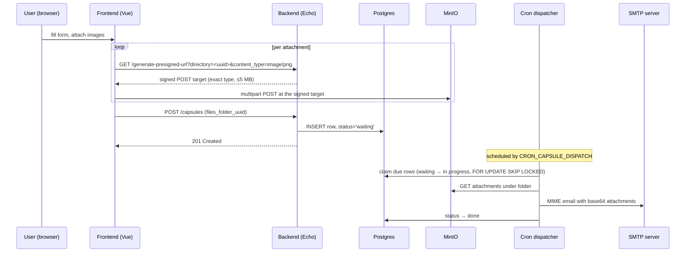

# Time Capsule Memories

[](https://github.com/MaxBarannikov/time-capsule-memories/actions/workflows/backend.yml)
[](https://github.com/MaxBarannikov/time-capsule-memories/actions/workflows/frontend.yml)
[](https://github.com/MaxBarannikov/time-capsule-memories/actions/workflows/docker.yml)


A small self-hosted service for scheduling a message — with optional image
attachments — to be delivered to a recipient by email at a future date. A Vue 3
frontend captures the form and pushes attachments straight to MinIO over signed
upload targets; a Go backend records the capsule in Postgres; a cron-driven
dispatcher picks up due rows and sends them over SMTP.


---

## Delivery flow



Why the browser uploads directly to storage, and how a failed delivery is
handled, are written up in [`docs/adr`](./docs/adr).

---

## Quick start

```bash
cp example.env .env
make up
```

`make up` builds and starts everything. The backend container waits for
Postgres, applies Goose migrations, then serves on `:8000`; Traefik routes by
`Host` header. `make up-prod` starts the same stack without the development
override described below.

| Service       | URL                               | Present in     |
| ------------- | --------------------------------- | -------------- |
| Frontend      | http://frontend.localhost         | always         |
| Backend API   | http://backend.localhost          | always         |
| Swagger UI    | http://backend.localhost/swagger/ | always         |
| MinIO console | http://minio.localhost            | always         |
| MinIO S3 API  | http://minio-api.localhost        | always         |
| pgAdmin       | http://pgadmin.localhost          | dev override   |
| MailHog       | http://localhost:8025             | dev override   |
| Traefik board | http://localhost:8080/dashboard/  | dev override   |

---

## Project layout

```
backend/
  cmd/                  entry point and Swagger metadata
  internal/
    app/                composition root: wiring, middleware, lifecycle
    config/             environment loading and startup validation
    database/           Postgres connection pool
    storage/            S3-compatible object storage
    handlers/           HTTP transport
    routes/             URL → handler registration
    services/           delivery logic and the SMTP mailer
    repository/         SQL data access
    jobs/               cron dispatcher
    validators/         request validation rules and messages
    middleware/         request id, recovery, access log, CORS
    models/             request/response types
    logging/            slog setup and request-scoped loggers
  migrations/           Goose migrations
frontend/
  src/
    api/                axios client and endpoint wrappers
    pages/ layouts/ components/
    store/ router/ i18n/
docs/adr/               architecture decision records
```

The dependency direction is one-way: `handlers → services → repository/storage`.
Handlers and the dispatcher depend on interfaces declared next to their
consumers (`services.CapsuleRepository`, `services.ObjectStore`,
`services.Mailer`), which is what lets both be tested without a database, an
object store or an SMTP server.

---

## Configuration

All settings come from environment variables — see [`example.env`](./example.env).
Credentials have no built-in defaults: the process refuses to start and reports
every missing variable at once rather than falling back to a value compiled into
the binary.

| Variable                     | Default                                           | Notes                                                        |
| ---------------------------- | ------------------------------------------------- | ------------------------------------------------------------ |
| `POSTGRES_USER`              | —                                                 | Used by compose and to build `DATABASE_URL`                  |
| `POSTGRES_PASSWORD`          | —                                                 |                                                              |
| `POSTGRES_HOST`              | —                                                 | `postgres` in compose, `localhost` for host-side development |
| `POSTGRES_PORT`              | —                                                 |                                                              |
| `POSTGRES_DB_NAME`           | —                                                 |                                                              |
| `DATABASE_URL`               | **required**                                      | Read by the app and by goose at startup                      |
| `PGADMIN_DEFAULT_EMAIL`      | —                                                 | Development override only                                    |
| `PGADMIN_DEFAULT_PASSWORD`   | —                                                 | Development override only                                    |
| `MINIO_ROOT_USER`            | **required**                                      |                                                              |
| `MINIO_ROOT_PASSWORD`        | **required**                                      |                                                              |
| `MINIO_ENDPOINT`             | **required**                                      | Must resolve to the same host for the backend and the browser |
| `MINIO_USE_SSL`              | `false`                                           |                                                              |
| `MINIO_BUCKET_NAME`          | `time-capsule`                                    | Created on startup if missing                                |
| `SMTP_HOST`                  | **required**                                      |                                                              |
| `SMTP_PORT`                  | **required**                                      |                                                              |
| `SMTP_FROM`                  | **required**                                      | Also the PLAIN auth username when a password is set          |
| `SMTP_PASSWORD`              | empty                                             | Empty means no authentication (e.g. MailHog)                 |
| `SMTP_TIMEOUT`               | `10`                                              | Seconds                                                      |
| `CRON_CAPSULE_DISPATCH`      | **required**                                      | Standard 5-field cron expression, evaluated in UTC           |
| `LOG_LEVEL`                  | `info`                                            | `debug` / `info` / `warn` / `error`                          |
| `CORS_ALLOWED_ORIGINS`       | `http://frontend.localhost,http://localhost:8001` | Comma-separated                                              |
| `ENABLE_TEST_EMAIL_ENDPOINT` | `false`                                           | See the security note below                                  |
| `VITE_BACKEND_API_URL`       | —                                                 | Inlined into the frontend bundle at **build** time           |

---

## Development

Common targets live in the root `Makefile`:

```bash
make help            # list targets
make up              # build and start everything (with dev tooling)
make up-prod         # start without pgAdmin, MailHog or the Traefik dashboard
make down            # stop and remove containers
make logs            # tail logs from all services
make test            # backend tests, with the race detector
make lint            # golangci-lint + eslint + prettier --check
make fmt             # gofmt, go mod tidy, prettier --write
make migrate-up
make migrate-down
make migrate-create name=add_something
```

`docker-compose.yml` describes the application. `docker-compose.override.yml`
adds the local development layer — pgAdmin, MailHog, the Traefik dashboard, and
database and object-store ports published on localhost. Compose merges the
override automatically, so `make up` gets both and `make up-prod` gets only the
first.

To iterate on the backend without rebuilding the image, run the infrastructure
on published ports and the Go server on the host:

```bash
cp backend/example-dev.env backend/.env
docker compose -f backend/docker-compose-dev.yml up -d
cd backend && make run
```

For the frontend dev server (Vite on port 8001):

```bash
cd frontend
cp example-dev.env .env
npm install
npm run dev
```

The Swagger spec under `backend/docs/` is generated from handler annotations and
committed so the API is browsable without a toolchain. Regenerate it with
`cd backend && make docs` after changing those annotations — CI fails if the
committed spec and the annotations disagree.

---

## Testing

```bash
cd backend && make test
```

Tests cover the layers where a mistake is expensive and a fake is cheap:
validation rules and their messages, config validation, the SQL repositories
(via `pgxmock`), capsule delivery and its failure paths, MIME message
construction, and the dispatcher's concurrency limit and error isolation. The
frontend is covered by lint, formatting and build checks in CI rather than by
unit tests.

---

## Security

This is a portfolio project. It is deliberately unauthenticated, and the
defaults in `example.env` are throwaway local credentials. Before exposing it to
anyone real:

- **Replace every credential** in `example.env` — Postgres, MinIO, pgAdmin, SMTP.
- **Terminate TLS** in front of Traefik or elsewhere. The bundled entrypoint
  listens on `:80` only.
- **Run without the development override** (`make up-prod`). The override
  publishes Postgres and MinIO on localhost and exposes an unauthenticated
  Traefik dashboard.
- **Leave `ENABLE_TEST_EMAIL_ENDPOINT` off.** `POST /send-test-email` is an
  unauthenticated SMTP smoke test: with it on, anyone who can reach the service
  can send arbitrary mail to any address through the configured relay.
- **Add rate limiting.** Nothing throttles capsule creation, feedback or upload
  targets.

What the service does enforce: the object key, the exact content type (from a
server-side allowlist of `image/jpeg`, `image/png`, `image/webp`, `image/gif`)
and the 5 MB size cap are all covered by the upload signature, so they hold even
if a client skips the browser entirely; request bodies are capped at 1 MB; CORS
is restricted to `CORS_ALLOWED_ORIGINS`; both images build from pinned bases and
run as non-root.

### Known limitations

- Attachments are held fully in memory when fetched from storage and again when
  base64-encoded for SMTP. The per-capsule read is bounded, but raising the
  3 × 5 MB limit means rethinking the encoding path — streaming instead of
  buffering.
- Directories uploaded to but never submitted are never cleaned up. A bucket
  lifecycle rule is the intended fix.
- A capsule whose delivery fails after SMTP accepted it stays `in progress` on
  purpose — see [ADR 0002](./docs/adr/0002-capsule-dispatch-and-failure-handling.md).
  Rescuing such a row requires a human.
