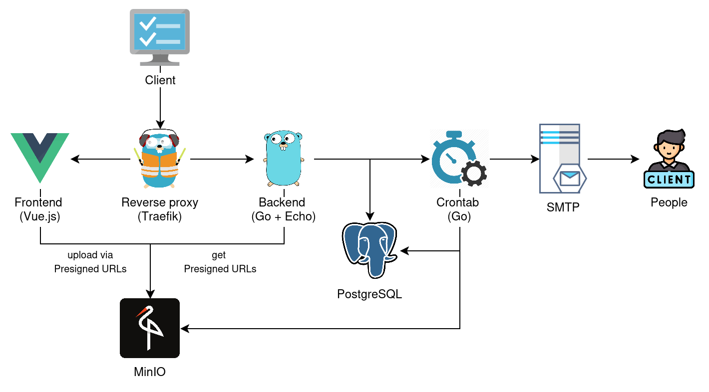
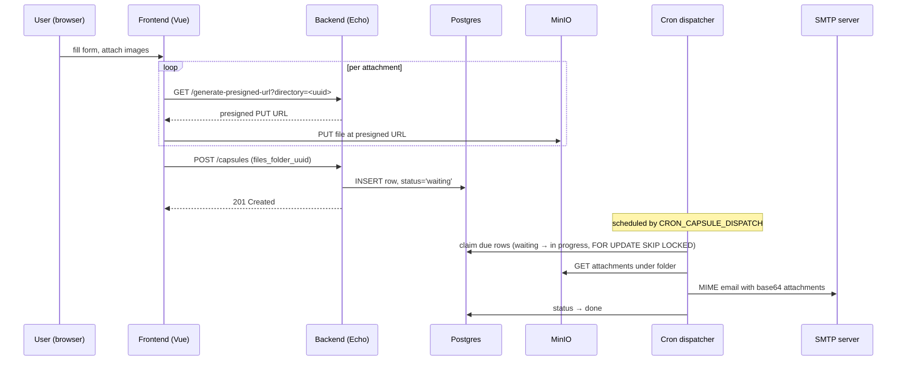

# Time Capsule Memories

A small self-hosted service for scheduling a message — with optional image attachments — to be delivered to a recipient by email at a future date. A Vue 3 frontend captures the form and pushes attachments straight to MinIO over presigned URLs; a Go backend records the capsule in Postgres; a cron-driven dispatcher picks up due rows and sends them over SMTP.



---

## Delivery flow



---

## Quick start

```bash
cp example.env .env
make up
```

`make up` is shorthand for `docker compose up`. The backend container waits for Postgres, applies Goose migrations, then starts the binary on `:8000`. Traefik routes by `Host` header.

| Service        | URL                                       |
| -------------- | ----------------------------------------- |
| Frontend       | http://frontend.localhost                 |
| Backend API    | http://backend.localhost                  |
| Swagger UI     | http://backend.localhost/swagger/         |
| MinIO console  | http://minio.localhost                    |
| MinIO S3 API   | http://minio-api.localhost                |
| pgAdmin        | http://pgadmin.localhost                  |
| MailHog        | http://localhost:8025                     |
| Traefik board  | http://localhost:8080/dashboard/          |

---

## Configuration

All settings come from environment variables — see [`example.env`](./example.env). Defaults below match what the backend ships with.

| Variable                | Default                                                | Notes                                                              |
| ----------------------- | ------------------------------------------------------ | ------------------------------------------------------------------ |
| `POSTGRES_USER`         | `user`                                                 |                                                                    |
| `POSTGRES_PASSWORD`     | `1234`                                                 |                                                                    |
| `POSTGRES_HOST`         | `localhost` (`postgres` in compose)                    |                                                                    |
| `POSTGRES_PORT`         | `5432`                                                 |                                                                    |
| `POSTGRES_DB_NAME`      | `time_capsule`                                         |                                                                    |
| `DATABASE_URL`          | derived from the five above                            | Used by goose at startup                                           |
| `MINIO_ROOT_USER`       | `minioaccesskey`                                       |                                                                    |
| `MINIO_ROOT_PASSWORD`   | `miniosecretkey`                                       |                                                                    |
| `MINIO_ENDPOINT`        | `minio-api.localhost`                                  | Host for the S3 API                                                |
| `MINIO_USE_SSL`         | `false`                                                |                                                                    |
| `MINIO_BUCKET_NAME`     | `time-capsule`                                         | Created on startup if missing                                      |
| `SMTP_HOST`             | —                                                      | Set to `mailhog` to skip auth/TLS in dev                           |
| `SMTP_PORT`             | —                                                      |                                                                    |
| `SMTP_FROM`             | —                                                      | Used as username for PlainAuth when `SMTP_PASSWORD` is set         |
| `SMTP_PASSWORD`         | —                                                      | Empty → no auth (e.g. MailHog)                                     |
| `SMTP_TIMEOUT`          | `10`                                                   | Seconds                                                            |
| `CRON_CAPSULE_DISPATCH` | —                                                      | Standard 5-field cron expression, evaluated in `Etc/UTC`           |
| `LOG_LEVEL`             | `info`                                                 | `debug` / `info` / `warn` / `error`                                |
| `CORS_ALLOWED_ORIGINS`  | `http://frontend.localhost,http://localhost:8001`      | Comma-separated                                                    |
| `VITE_BACKEND_API_URL`  | —                                                      | Read by the frontend at build time                                 |

---

## Development

Common targets live in the root `Makefile`:

```bash
make help            # list targets
make up              # docker compose up
make down            # docker compose down
make logs            # docker compose logs -f
make test            # run backend tests
make lint            # backend (golangci-lint) + frontend (eslint)
make fmt             # prettier across the frontend
make migrate-up
make migrate-down
make migrate-create name=add_something
```

To iterate on the backend without rebuilding the image, run only the infrastructure on the host network and run Go locally:

```bash
cp backend/example-dev.env backend/.env
docker compose -f backend/docker-compose-dev.yml up -d
cd backend && make run
```

For the frontend dev server (Vite on port 8001):

```bash
cd frontend
npm install
npm run dev
```

Backend tests:

```bash
cd backend && make test
```

Swagger annotations regenerate via `cd backend && make docs_generation` after changing handler comments.

---

## Production notes

This is a portfolio project and the defaults are tuned for local development. Before exposing it to anyone real:

- Replace every credential in `example.env` — Postgres, MinIO, pgAdmin, SMTP.
- Put TLS in front of Traefik (or terminate elsewhere). The bundled config listens on `:80` only.
- Sample size matters: attachments are loaded fully into memory both when fetched from MinIO and when base64-encoded for SMTP. The `el-upload` limit is 3 images × 5 MB; raising it requires rethinking the encoding path.
- Capsule rows that flip to `in progress` and then crash mid-send stay stuck on purpose — see ADR 0002. A sweeper or manual rescue is needed if the dispatcher dies between SMTP success and the DB update.
